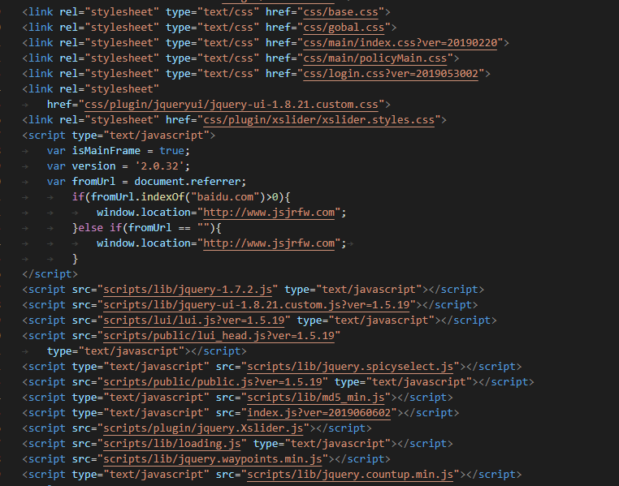
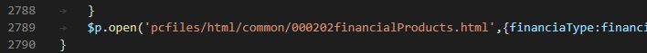
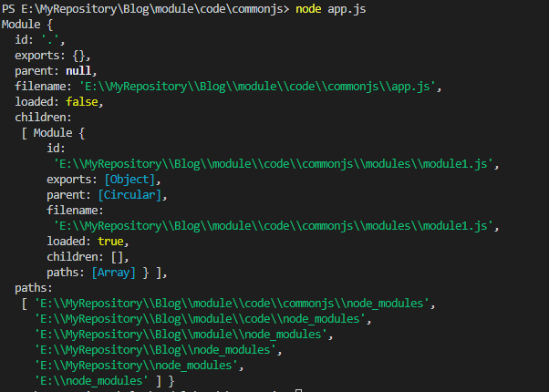
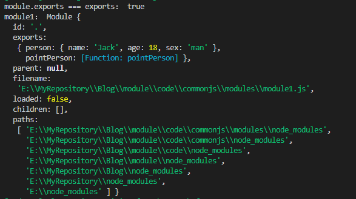
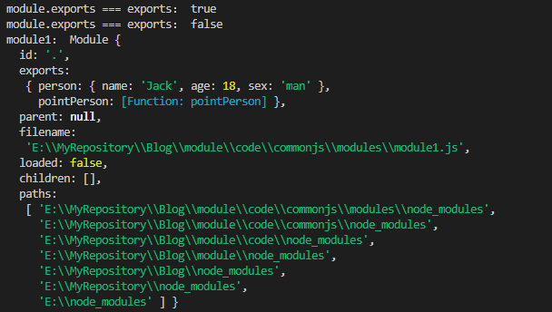
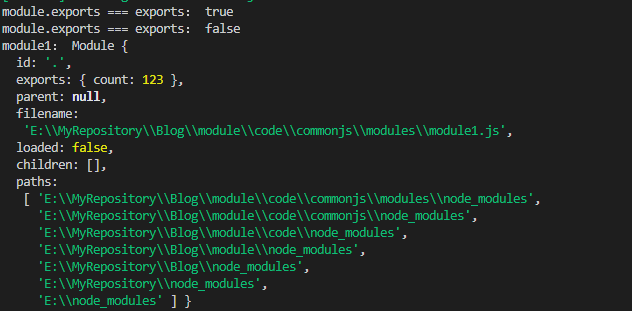

# JavaScript 的模块化


## 前言

本文主要内容是用来分析 **CommonJs 规范** 和 **ES6Moudle** 两个模块化方式的，对于其他的模块化方式本文未做分析。

在本文，希望你能够收获到：

- <a href="#project">前端工程化的概念</a>
- <a href="#module">模块化的概念、优点</a>
- 系统的了解 CommonJs 规范
  - <a href="#moduleObj">CommonJs 模块的本质</a>
  - <a href="#exportsModule">暴露模块的机制</a>
  - <a href="#requireModule">加载模块的机制</a>
- 系统的了解 ECMAScript Module
- 两者的对比

## 正文开始

在现代前端开发中，我想听到最多的应该是工程化、模块化、组件化这几个概念了吧。<br>
或许你不能流畅的描述什么是工程化、模块化、组件化。<br>
但是，你一定用到过。

你肯定用到过如下指令：

```javascript
npm run serve | dev
npm run build
npm run lint
...
```

你也肯定用到过如下语法：

```javascript
const http = require("http");
import { log } from "@/utils";
...
```

你也肯定用过如下结构：

```javascript
<a-button type="primary">Primary</a-button>
// 或者
<el-button type="primary">主要按钮</el-button>
...
```

呐，这些都是你日常用到，再熟悉不过的开发方式了对吧。

## <a name="project" style="color:#000;">工程化</a>


目前来说，随着浏览器的发展、网络的发展、前端生态圈的发展...
总之时代在进步，人们的需求不断增加，有需求就有业务。
现在，web 业务日益复杂化和多元化，纵观市场上的项目，都已经不再是过去的拼个页面 + 搞几个 jQuery 插件就能完成的了。前端开发已经由 webPage 模式为主转变为以 webApp 模式为主了。运行在 web 端的 app，可见其复杂度。

> 综上所述，我们开发一个前端项目不再是从画页面，几个页面互相跳转一下的时代。
> 我们要将项目看做一个工程，从大局出发，一个项目要使用哪些工具，要使用哪些技术，哪些部分是复用的，要如何高效的抽离，如果优化性能，如果加载资源，如何使开发更规范，如何使后期维护更高效等等。
>
> 转换一下，所谓前端工程化是不是就是我们日常开发中使用的 模块化、组件化、规范化、自动化的集合体？
> 前端工程化是不是前端质的变化呢？
>
> 而对于日常开发中使用的 webpack、vue、angular、react、ant-design、element-ui... 你不能说它们就是前端工程化，它们只是实现前端工程化的方式而已。
>
> 我们要做的是前端工程师，而不是前端页面师。


**是不是有点跑题了呢，本文主要目的是说模块化的啊，我觉得工程化还是有必要放在模块化之前提一下的**

## <a name="module" style="color:#000;">模块化</a>

我们已经意识到了前端的 web 程序越来越复杂，也默转潜移的身处于前端工程化的潮流中，是否有种 “初闻不知曲中意，再听已是曲中人” 的意思了呢。

那 **"模块化"** 又是什么呢？

> 对于工程化来说，它是工程化的下游分支；<br>
> 对于 JavaScript 来说，它是一种代码的组织方式；<br>
> 对于程序来说，它是一种清晰的、易于维护、高效的开发方式。

### 在没有模块化之前

**你有没有见过这样的代码**：



在很长的一段时间里，前端只能通过一系列的 `<script>` 标签来维护我们的代码关系，但是一旦我们的项目复杂度提高的时候，这种简陋的代码组织方式便是如噩梦般使得我们的代码变得混乱不堪。
**并且，这种方式将多个 js 文件一股脑的引入到页面，其实都是在一个全局执行环境下，很容易造成变量污染的问题**

**亦或者这样的代码**：



一个 js 文件里 3000 行代码，一段代码这粘贴一块，那粘贴一块，维护这 3000 行代码，难度可想而知....

**我想从上面的代码不难看出以往开发的痛点在哪里了。**

### 模块化后

我们既然知道痛点在哪里，就应该从痛点出发，去解决问题。<br>
我们思考下，如果要解决上面的几个问题，我们要怎们做？

- 首先需要解决多个脚本引入的依赖关系问题
  - 有没有哪种方式能够明确的看到某个脚本依赖哪些脚本？
  - 并且不用在一股脑的在页面中如此引用，太混乱了。
- 其次需要解决多个脚本都在一个全局执行环境中，变量都混在一起。
  - 有没有什么方式能够使脚本之间独立运行，互不影响？
- 然后，某个脚本由于业务复杂，不能都写在一个文件里面
  - 能不能一个脚本实现的业务拆成多个文件，分开管理？

有问题，也就会有解决问题的方式 -- 模块化就为此而生

**概念：**

- 将一个复杂的程序依据一定的规则（规范）封装成几个块（文件），并进行组合在一起
- 块的内部数据与实现是私有的，只是向外部暴露一些接口（方法）与外部其它模块通信

> 其实模块化就是将一个复杂的系统分解成多个独立的模块的代码组织方式；
>
> **很多人觉得模块化开发的工程意义是复用，其实应该是模块化开发的最大价值应该是分治。不管你将来是否要复用某段代码，你都有充分的理由将其分治为一个模块。**

**模块化好处：**

- 避免命名冲突（减少命名空间污染）
- 更好的分离，按需加载
- 更高复用性
- 高可维护性

### 说明

好，说了这么多可算把模块化的概念说完了。

更多的还有关于模块化的进化过程：

> 全局 function 模式 => namespace 模式 => IIFE 模式 => IIFE 模式增强 : 引入依赖

具体的几种模块化的规范：

> - IIFE
> - AMD
> - CMD
> - CommonJS
> - UMD
> - ES6 Modules

就不再逐一分析，重点还是放到 **CommonJs** 和 **ES6 Modules** 中，因为这两个是目前用的最多的。

## CommonJs

### 1. 概述

随着 Javasript 应用进军服务器端，业界急需一种标准的模块化解决方案，于是，CommonJS 应运而生。这是一种被广泛使用的 Javascript 模块化规范，大家最熟悉的 Node.js 应用中就是采用这个规范。

在 Node.js 模块系统中，每个文件都被视为一个独立的模块。模块有自己的作用域，一个模块内部所有的变量、函数、类 都是私有的，模块之间不能直接访问模块内部。<br>
**在服务器端，模块的加载是运行时同步加载的；在浏览器端，模块需要提前编译打包处理。**

### 2. 基本语法

- 暴露模块：

  - `exports.xxx = value`
  - `module.exports = value`

- 导入模块：
  - `require(xxx)`
    - 如果是第三方模块，xxx 为模块名；
    - 如果是自定义模块，xxx 为模块文件路径；

### 3. 特点

- 所有代码都运行在模块作用域，不会污染全局作用域。
- 模块可以多次加载，但是只会在第一次加载时运行一次，然后运行结果就被缓存了，以后再加载，就直接读取缓存结果。要想让模块再次运行，必须清除缓存。
- 模块加载的顺序，按照其在代码中出现的顺序。

### 4. 分析

好，我们大致了解了下 CommonJs，现在让我们逐步分析

#### <a name="moduleObj" style="color:#000;">4.1 module 对象</a>

已知在 node 中，每个文件都是一个独立的模块，那么，这个 “模块” 到底是什么呢？<br>
nodejs 官网告诉我们：**在每个模块中都有一个名为 module 的自由变量是对表示当前模块的对象的引用**。

现在，新建一个 app.js 文件，在里面尝试打印下 module

```javascript
console.log(module);

node app.js
```



顺利的话，你应该可以看到类似的输出，没错，module 是一个可访问的对象，<br>
而这个对象，就是代表了当前文件(模块)的引用；<br>
现在知道 commonjs 中的模块是什么了吧。

##### module 对象的属性

- **id：** 模块的标识符。 通常是完全解析后的文件名。
- **exports：** module.exports 对象由 Module 系统创建

  > **exports 属性是重中之重，这个属性是对外的接口，在外部加载模块时，其实加载的是这个模块的 module.exports 属性。我们在暴露属性时，也是通过将属性挂载到 module.exports 上面进行暴露操作的。**

- **parent：** 标识最先引用该模块的模块。
- **filename：** 模块的完全解析后的文件名。
- **loaded：** 模块是否已经加载完成，或正在加载中。
- **children：** 被该模块引用的模块对象。
- **paths：** 模块的搜索路径。

#### <a name="exportsModule" style="color:#000;">4.2 暴露模块</a>

在暴露模块时，我们有两种方式来将属性暴露出去：**module.exports 和 exports**

> exports 是一个对于 module.exports 的更简短的引用形式。<br>
> exports 变量是在模块的文件级作用域内可用的，且在模块执行之前赋值给 module.exports。

**实际上：**
一个模块最终暴露的是 module 整个对象，而在引用时，引用的是 module 对象的 exports 属性，**module.exports 始终作为一个模块的输出接口**，以供外部访问内部的变量。

在一个模块作用域中，还有一个 exports 属性，与 module.exports 属性是同一个引用，指向同一个数据，使用 `exports.xxx` 的方式，可以将对应的属性挂载到 module.exports 属性上，从而达到暴露属性的目的，如下所示：

```javascript
// module1.js

person = {
  name: "Jack",
  age: 18,
  sex: "man"
};

function pointPerson() {
  console.log("point person at module1.js：", person);
}

exports.person = person;
module.exports.pointPerson = pointPerson;

console.log("module.exports === exports：", module.exports === exports); // true
console.log("module1：", module);
```



> 可以看到 exports 与 module.exports 是同一个引用；
>
> 无论使用 **exports** 还是使用 **module.exports** 都挂载到了 module 下面，也会在将来暴露出去；

如果我们将 module.exports 或者 exports 的引用改变了呢？

1. 我们先将 exports 的引用改变：

```javascript
// module1.js

person = {
  name: "Jack",
  age: 18,
  sex: "man"
};

function pointPerson() {
  console.log("point person at module1.js：", person);
}

exports.person = person;
module.exports.pointPerson = pointPerson;

console.log("module.exports === exports：", module.exports === exports); // true
// console.log('module1：', module);

exports = { index: 1 };
exports.a = "aaa";
console.log("module.exports === exports：", module.exports === exports); // false

console.log("module1：", module);
```



> 承接未更改 exports 引用，对比发现，exports 不再和 moudle.exports 全等，给 exports 添加的属性也没有被添加到 module.exports 上面；
>
> 由于**module.exports 始终作为一个模块的输出接口**，当 exports 与 module.exports 发生断链后，再往 exports 上面添加属性，将不再被暴露出去；

2. 尝试改变 module.exports 的引用：

```javascript
// module1.js

module.exports = {
  count: 123
};

console.log("module.exports === exports：", module.exports === exports); // false
console.log("module1：", module);
```



> 同样的，exports 与 module.exports 不再全等。在这一步的情况下，exports 还指向旧的 moudle.exports 指向的对象，并未自动的随着 module.exports 的改变而改变；
>
> 区别于改变 exports 的引用，直接改变 module.exports 的引用是真实有效的；最终暴露出去的接口，始终取决于 module.exports 的指向。

如果要改变 module.exports 的引用，大可将 exports 的引用改成同一个引用，如下：

```javascript
// module1.js

module.exports = exports = {
  count: 123
};

console.log("module.exports === exports：", module.exports === exports); // true
```

#### <a name="requireModule" style="color:#000;">4.3 加载模块</a>

在进一步了解模块的加载机制前，我们需要先了解下模块的作用域。 <br>
在模块作用域中，有若干个 node 给我们预置的变量，其中就包括前面说的 module 对象、exports 引用，除了这两个，还有其他的变量或方法供我们使用：

- \_\_dirname

#### 小结

1）在 node 中，每个文件都是独立的模块；
2）在每个模块中，都有一个名为 module 的自由变量，用来表示当前模块的引用；
3）module 对象下面的 exports 属性是最终引用的关键属性
4）暴露模块有两种方式，module.exports && exports

- exports 是 module.exports 的简写
- 它们两个在最初时指向同一个地址
- 改变其中任意一个，都会使 exports 和 moudle.exports 断链
- 最终暴露出去的接口，完全取决于 module.exports 属性
